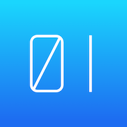
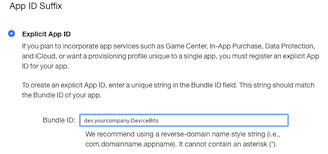
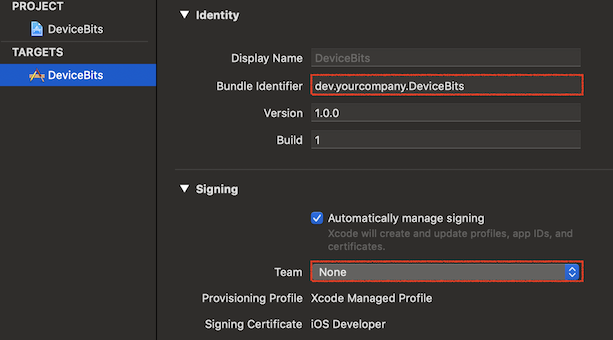
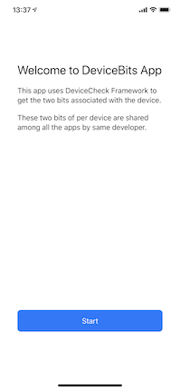
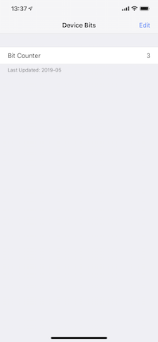

# AppPattern: DeviceBits

[](https://opensource.org/licenses/MIT)



This is an implementation example of an application feature called "DeviceBits".

Since iOS 11, developers can get the two bits associated with each device.
This project implemented a 2-bit counter using the DeviceCheck API. 
Counter values ​​are unique for each device and shared among all apps generated by the same developer.

This project contains both iOS app and server side app. 

- [Features](#Features)
- [Requirements](#requirements)
- [Author](#author)
- [License](#license)

## Features
- [x] Sample code of DeviceCheck framework.
- [x] Supports query / update / validate APIs.

## Requirements

* iOS 12.0+
* Xcode 10.0+
* Swift 4.2+

### Setup

1. Create an explicit App ID for DeviceBits App.

   

2. Update `Bundle Identifier` and `Signing` to match created App ID.

   

3. Open [Server/index.js](Server/index.js) and update the configurations to match your developer account. For details about Private Key, see [Communicate with APNs using authentication tokens](https://help.apple.com/developer-account/#/deva05921840).

	```swift
	/* A 10-character Team ID, obtained from your developer account (https://developer.apple.com/account/) */
	const teamID = "YOURTEAMID"
	
	/* A 10-character key identifier, obtained from your developer account (https://developer.apple.com/account/) */
	const keyIdentifier = "YOURKEYID"
	```

4. Open [AuthKey.p8](Server/AuthKey.p8) file and overwrite the content with the private key downloaded from [Certificates, Identifiers & Profiles](https://developer.apple.com/account/ios/certificate).

5. Install packages and run the server app.

	```sh
	cd Server
	npm install
	node index.js
	```

6. Open [BitCounterAPI.swift](DeviceBits/BitCounterAPI.swift) and update `baseURL` to your mac IP address.

	```swith
	/* Rewrite this URL according to your environment. */
	static let baseURL = "http://192.168.1.1:3000"
	```

7. Run the iOS app on your device.

## Screenshots




## Author

Watanabe Toshinori – toshinori_watanabe@tiny.blue

## License

This project is licensed under the MIT License. See the [LICENSE](LICENSE) file for details.
